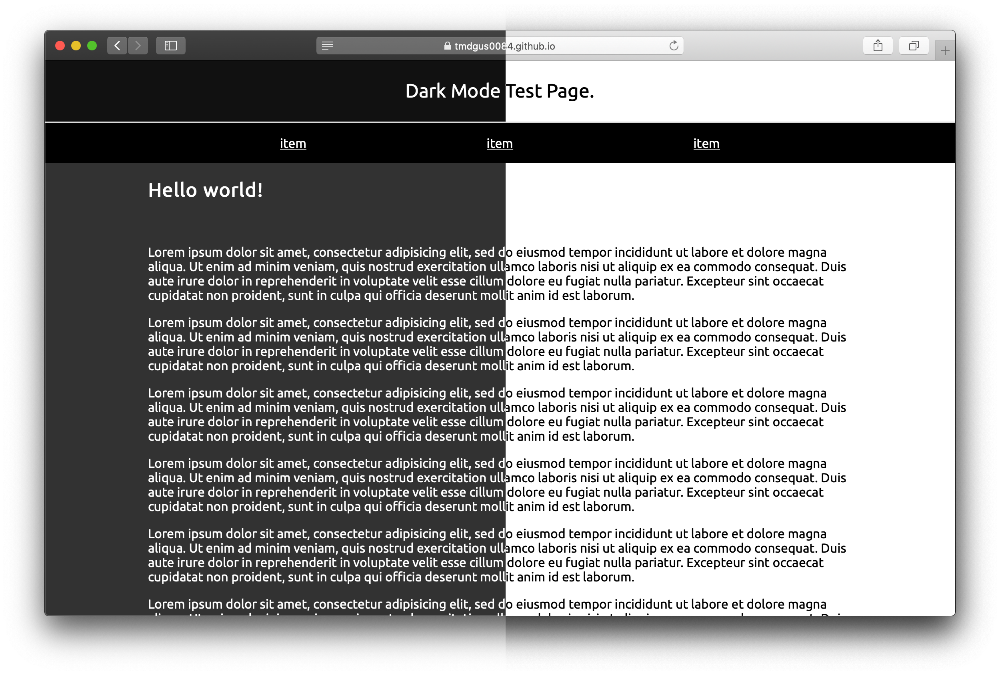
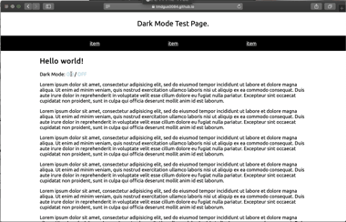

# 🌙 Darkmode web design

- [한국어](https://github.com/tmdgus0084/apple-dark-mode/blob/master/README.md)
- [English](https://github.com/tmdgus0084/apple-dark-mode/blob/master/README.en.md)

## Table of contents
1. [What is the Dark mode?](#what-is-the-dark-mode)
2. [Recognizing Dark mode](#recognizing-dark-mode)
3. [Turn Dark mode on and off](#turn-dark-mode-on-and-off)
4. [Animation](#animation)

## What is the Dark mode?
At 2:00 a.m. on September 20, 2019, Apple started a deployment of new operating system, ios 13, for iPhone and iPod touch. Also  on early June, in same year, at the held WWDC2019(The Apple Worldwide Developers Conference), Apple offered the way that web developers can respond to design of Dark mode for new ios13 and deployed Macos Mojave previously. Dark mode is the UI that has a  overall dark appearance, with white writing on a black background unlike before that displayed black letters on a white background. Because black color is used a lot in its design, there are advantages that it can reduce power consumption in device with OLED display like iPhone 11Pro and also make one's eyes feel much more comfortable. For more uniformity UI or UC, this article deal with the way that change a website to dark design automatically when Dark mode user acess the website.

## Recognizing Dark mode
To apply the Dark mode in the moment that users acess a web site, it needs to make sure user's device is in use before anyting else. The manners for this in CSS and JavaScript are following below text.

#### CSS
CSS support 'prefers-color-scheme' mediaquery that tell you which theme your device uses CSS. 'prefers-color-scheme' mediaquery can have the following result.

- no-preference: Don't notify theme.
- light: Light mode in use.
- dark: Dark mode in use.

Therefore it can be able to write CSS code that only operate for Dark mode users through the code below.
```css
@media (prefers-color-scheme: dark) {
  body {
    background: black;
    color: white;
  }
}
```

Unfortunatly, some browsers do not apply 'prefers-color-scheme' mediaquery or have other result with actual user device's system theme settiong.

 - ✅ : Supported.
 - ❌ : Not supported or has a different value from the system theme settings.

| OS / Browser  | Safari | Chrome | Firefox | Whale |
| ------------- |:------:|:------:|:-------:|:-----:|
| iOS           |✅      |❌      |❌      |❌     |
| iPadOS        |✅      |❌      |❌      |❌     |
| macOS         |✅      |✅      |✅      |❌     |


#### JavaScript
In JS, you have to borrow CSS's mediaquery and check it. Because CSS depends on mediaquery, compatibility is decided in accordance with support status of 'prefers-color-scheme' mediaquery.
```javascript
const darkModeMeidaQuery = window.matchMedia('(prefers-color-scheme: dark)');

function updateForDarkModeChange() {
  if (darkModeMeidaQuery.matches) {
    // Dark mode is on.
  } else {
    // Dark mode is off.
  }
}

darkModeMeidaQuery.addListener(updateForDarkModeChange);
updateForDarkModeChange();
```

Now, we applied the following code and succeed supporting Dark mode.

```css
@media (prefers-color-scheme: dark) {
  body {
    background: #323232;
    color: #fff;
  }

  header {
    background: #111;
  }

  footer {
    background: #111;
  }
}
```



All CSS codes related with Dark mode are in one mediaquery. Therefore, CSS codes of Dark mode are put aside in file named 'dark.css' and can be controlled with mediaquery of file-level as utilizing 'media' property of 'link' tag.

#### dark.css
```css
/*
  media=(prefers-color-scheme: dark)
*/

body {
  background: #323232;
  color: #fff;
}

header {
  background: #111;
}

footer {
  background: #111;
}
```

#### index.html
```html
...
<link rel="stylesheet"
      href="assets/css/dark.css"
      media="(prefers-color-scheme: dark)">
...
```

## Turn Dark mode on and off
The above-mentioned Dark mode recognition grammar only operates some browsers of more than iOS13, iPadOS, MacOS Mojave. If you don't use  apple devices of the latest version or browser or supported browser, it doesn't operate. The following contents deal with methods how to encourage end users to acess the dar k mode.

앞서 파일을 분리하기 위해 추가한 `link` 요소의 `media` 속성을 조작하는 것으로 해당 CSS를 활성화하거나 비활성화할 수 있습니다. 우선 다크모드를 끄고 켜는 JavaScript 함수를 `darkModeSwitch`라고 하고 이를 조작할 버튼을 만듭니다.
```html
<p>
  Dark Mode:
  <a onclick="darkModeSwitch(true)">ON</a>
  /
  <a onclick="darkModeSwitch(false)">OFF</a>
</p>
```

And grant id to added 'link' tag for calling in 'dark.css' from above.
```html
<link id="dark-mode-sheet"
      rel="stylesheet"
      href="assets/css/dark.css"
      media="(prefers-color-scheme: dark)">
```

Define  above-mentioned 'darkModeSwitch'function. Here, we will manipulate the 'link' properties of the 'media' element.
```javascript
function darkModeSwitch(status) {
  document
  .querySelector('#dark-mode-sheet')
  .setAttribute(
    'media',
    status? 'screen' : 'not screen'
  );
}
```

We have added the ability to switch the dark mode off and on without difficulty. However, if the user refreshes the webpage or moves to another page, dark mode is turned off. To solve this problem, save settings to browser by using Cookie and always try to decorate your web page according to this setting.

In this article, we use the 'JavaScript Cookie' library to manipulate a Cookie.
[Learn more](https://github.com/js-cookie/js-cookie)

First, save it as a Cookie whenever you change to dark mode. 쿠키는 문자열로 값을 저장하기 때문에 상태값을 정수형으로 변환해서 저장하였습니다. 그리고 이 값을 가져오는 함수 `isDarkMode`도 추가합니다.
```javascript
function isDarkMode() {
  return Cookies.get('darkmode');
}

function darkModeSwitch(status) {
  Cookies.set('darkmode', +status);
  document
  .querySelector('#dark-mode-sheet')
  //중략
}
```

You should now manipulate the page based on this value when the webpage starts. 쿠키값이 있다면 사용자 기기의 다크모드 설정을 무시하고 쿠키값에 따라 페이지를 조작합니다. 만약 쿠키값이 없다면 아무런 조작도 하지 않습니다. 저장된 값은 정수로 이루어진 문자열이므로 이를 다시 정수형으로 변경해줍니다.

```javascript
//전략
document.addEventListener('DOMContentLoaded', function () {
  const isDm = isDarkMode();
  if (isDm != null) darkModeSwitch(+isDm);
});
```

Now, you can fully support dark mode for all users.

## Animation
When it changes to dark mode, adding an animation results in a more complete web design.


```css
body {
  transition: .5s background, .5s color;
}

header {
  transition: .5s background;
}

footer {
  transition: .5s background;
}
```

The page used for the test can be found by pressing [here(https://tmdgus0084.github.io/apple-dark-mode/)].
I hope you will explore and develop more resources for user experience of a variety of users.
If this article helps, press the star⭐️ please!
Thank you.
